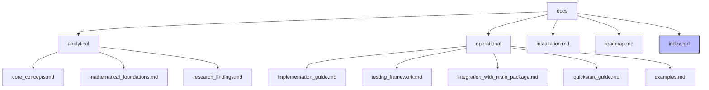

# NTQR Fork Documentation

This directory contains the documentation for our fork of the NTQR package. The documentation is organized into two main categories:

- **Analytical Documentation** (`analytical/`): Contains theoretical analyses, mathematical foundations, and research insights related to our extensions of the NTQR package.

- **Operational Documentation** (`operational/`): Contains practical guides, implementation details, and operational considerations for using our fork.

## Documentation Structure

## Quick Navigation

### Getting Started
- [Installation Guide](installation.md)
- [Quickstart Guide](operational/quickstart_guide.md)
- [Examples](operational/examples.md)

### Theoretical Background
- [Core Concepts](analytical/core_concepts.md)
- [Mathematical Foundations](analytical/mathematical_foundations.md)
- [Research Findings](analytical/research_findings.md)

### Implementation Resources
- [Implementation Guide](operational/implementation_guide.md)
- [Testing Framework](operational/testing_framework.md)
- [Integration with Main Package](operational/integration_with_main_package.md)

### Development
- [Project Roadmap](roadmap.md)

## Main Topics Covered

- Core algebraic evaluation concepts and our extensions
- Mathematical foundations of NTQR and our adaptations
- Implementation guides for our custom extensions
- Testing frameworks and methodologies
- Integration with the main NTQR package
- Practical examples and use cases
- Future development directions

## Contributing to Documentation

When adding new documentation:

1. Place theoretical and mathematical content in the `analytical/` directory
2. Place practical guides and operational details in the `operational/` directory
3. Use Markdown for all documentation files
4. Include Mermaid diagrams for visual explanations where appropriate
5. Reference the main NTQR package documentation when extending existing concepts
6. Update the index and navigation links in this README when adding new documents
7. Provide practical examples when documenting new features or extensions 