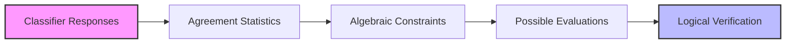
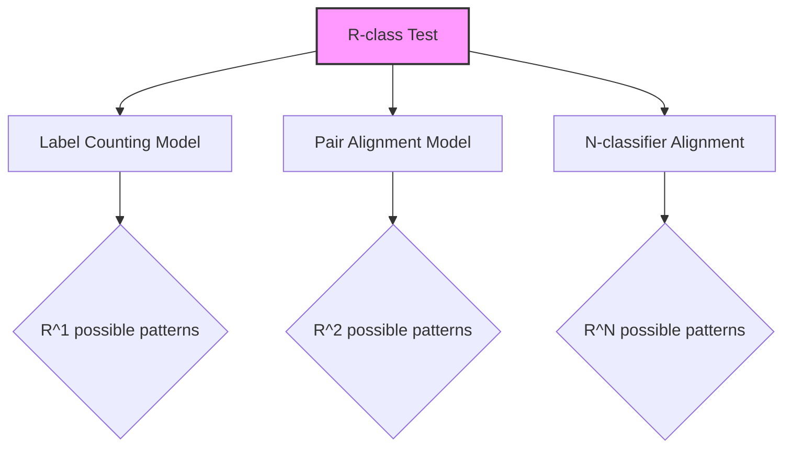

# Core Concepts of Algebraic Evaluation

This document outlines the fundamental concepts of algebraic evaluation as implemented in the NTQR package, with our specific interpretations and extensions.

## Algebraic Evaluation Fundamentals

Algebraic evaluation is a logical framework for validating algorithms that evaluate classifiers on unlabeled data tests. Unlike traditional evaluation methods that rely on probability theory or domain representations, algebraic evaluation uses logical axioms and algebra to derive constraints on possible evaluations.



## Key Properties of NTQR Logic

### 1. Universality

NTQR's algebraic approach applies to any domain without Out-of-Distribution (OOD) problems because it doesn't use probability theory. By using only summary statistics of how classifiers labeled a test set, we treat all classifiers (human or AI) as black boxes. There are no hyperparameters to tune, making the approach truly universal.

### 2. Completeness

The finite nature of any test given to a group of classifiers guarantees the existence of a complete set of postulates that must be obeyed during evaluation. This completeness provides a logical safety shield, allowing us to create theorem provers that can detect violations of logical consistency in any grading algorithm.

### 3. Self-Alarming

Algebraic evaluation algorithms can warn when their assumptions are wrong - the most important safety feature of this approach. This addresses Charles Perrow's observation from "Normal Accidents":

> "Unfortunately, most warning systems do not warn us that they can no longer warn us."

## R-class Tests and Evaluation Models

An R-class test refers to a test with R possible responses (e.g., R=2 for binary classification, R=3 for ternary classification). The NTQR package supports different evaluation models:



## Axioms and Constraints

The axioms in NTQR create geometric constraints on the possible evaluations:

### Single Classifier Axioms

For a binary classifier (R=2), if we denote the accuracy on positive examples as p₁ and accuracy on negative examples as p₀, the single classifier axiom creates the constraint:

```
n₁₁/n₁ + n₀₀/n₀ - 1 = 0
```

Where:
- n₁₁: true positives
- n₀₀: true negatives
- n₁: total positives
- n₀: total negatives

This forms a plane in the evaluation space, restricting possible evaluations to lie on this plane.

### Pair Axioms

When considering pairs of classifiers, additional constraints emerge based on how they agree and disagree on different label types.

## Error Correlation Measures

The axiomatic formalism naturally incorporates measures of error correlation between classifiers. These statistics are sample-specific to a given test, just like individual label accuracies.

## Error Independent Evaluation

For error-independent classifiers (whose errors are uncorrelated), we can solve the axioms for ensembles of three or more classifiers to obtain point estimates of performance. This allows us to improve upon majority voting by first evaluating the classifiers and then deciding whether to use majority voting based on the evaluation results.

## Our Extensions

Our fork extends these core concepts by:

1. Developing more sophisticated algebraic constraints for higher-dimensional evaluation spaces
2. Exploring alternative evaluation models beyond the standard label counting approach
3. Investigating the theoretical limits of algebraic evaluation with real-world noise patterns

These extensions aim to enhance the practical applicability of NTQR while maintaining its logical rigor and safety guarantees. 