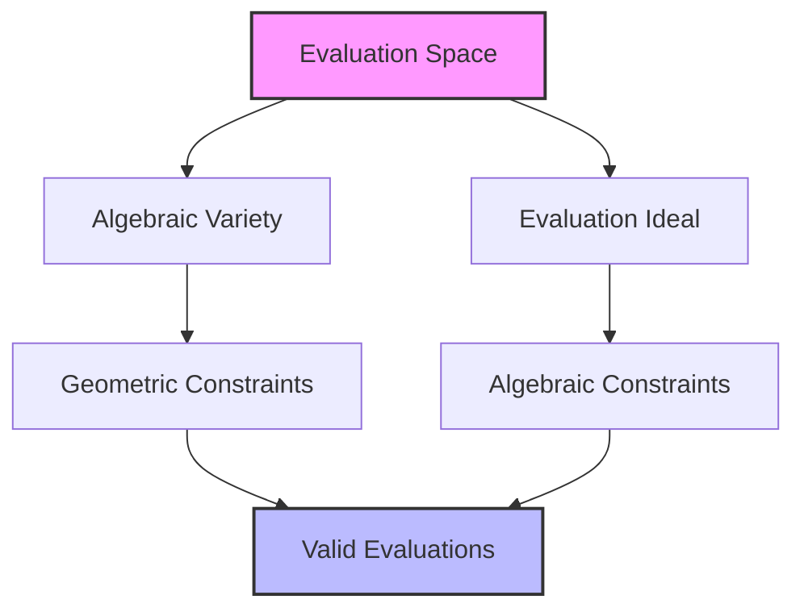
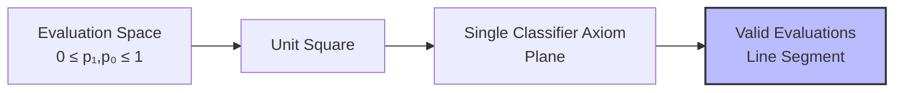
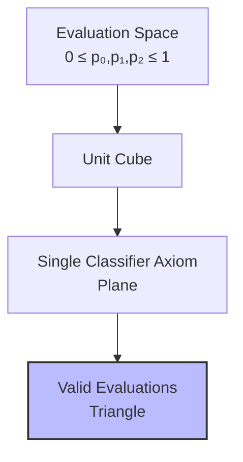

# Mathematical Foundations of NTQR

This document outlines the mathematical foundations of the NTQR package, focusing on the algebraic geometry that underpins its evaluation logic.

## Algebraic Geometry of Evaluation Space

The core of NTQR is based on algebraic geometry concepts that create a rigorous framework for evaluation. This approach represents possible evaluations as points in a geometric space constrained by algebraic axioms.



## Binary Classification (R=2) Mathematics

For binary classification, the fundamental axiom creates a linear constraint in the evaluation space.

### Single Classifier Axiom

Let:
- p₁: Accuracy on positive examples
- p₀: Accuracy on negative examples
- n₁: Number of positive examples
- n₀: Number of negative examples

The single classifier axiom is expressed as:

```
p₁ + p₀ = 1 + (n₁₁ + n₀₀ - n)/n
```

Where:
- n₁₁: Number of true positives
- n₀₀: Number of true negatives
- n: Total number of examples (n = n₁ + n₀)

This creates a plane in the (p₁, p₀) space, restricting valid evaluations to lie on this plane.

### Geometric Interpretation of Binary Classification

In the binary classification evaluation space:



The intersection of the unit square (0 ≤ p₁,p₀ ≤ 1) with the axiom plane creates a line segment of possible evaluations.

## Ternary Classification (R=3) Mathematics

For ternary classification (R=3), the mathematics becomes more complex. We now have three accuracy parameters:
- p₀: Accuracy on class 0
- p₁: Accuracy on class 1
- p₂: Accuracy on class 2

### Single Classifier Axiom for R=3

The axiom extends to:

```
p₀ + p₁ + p₂ = 1 + (n₀₀ + n₁₁ + n₂₂ - n)/n
```

Where:
- n₀₀, n₁₁, n₂₂: True classifications for each class
- n: Total number of examples

### Geometric Interpretation for R=3



The intersection of the unit cube with the axiom plane creates a triangle of possible evaluations.

## Multiple Classifier Ensembles

When evaluating ensembles, additional axioms emerge from the relationships between classifiers.

### Error Independence Assumption

For error-independent classifiers, the probability of both classifiers making errors on the same example equals the product of their individual error probabilities:

```
P(classifier₁ error ∩ classifier₂ error) = P(classifier₁ error) × P(classifier₂ error)
```

This assumption creates additional constraints that further restrict the evaluation space.

### Trio of Binary Classifiers

For a trio of binary classifiers under the error independence assumption, we get a system of equations:

```
e₁e₂ = e₁₂
e₁e₃ = e₁₃
e₂e₃ = e₂₃
```

Where:
- e₁, e₂, e₃: Error rates for classifiers 1, 2, and 3
- e₁₂, e₁₃, e₂₃: Joint error rates for pairs

This system can be solved to yield point estimates of individual classifier accuracies.

## Algebraic Variety and Ideal

The NTQR package uses algebraic geometry concepts:

- **Evaluation Ideal**: The set of polynomial equations that define the constraints on evaluations
- **Evaluation Variety**: The geometric representation of valid evaluations (solutions to the ideal)

Using computational algebraic geometry, we can find:

1. The dimension of the evaluation variety (degrees of freedom in valid evaluations)
2. The minimal generating set for the evaluation ideal (simplest constraints)
3. The irreducible components of the variety (distinct evaluation scenarios)

## Implications for Evaluation

This mathematical foundation has several important implications:

1. We can provably determine if an evaluation is logically possible given observed agreements
2. We can calculate the exact boundaries of possible evaluations
3. We can detect when evaluation assumptions (like error independence) are violated

## Extensions in Our Fork

Our fork extends these mathematical foundations by:

1. Developing techniques for higher-dimensional R-class problems (R > 3)
2. Exploring alternative constraint systems based on different error correlation models
3. Investigating approximation techniques for computationally intensive cases
4. Formalizing new axioms for specific evaluation scenarios 