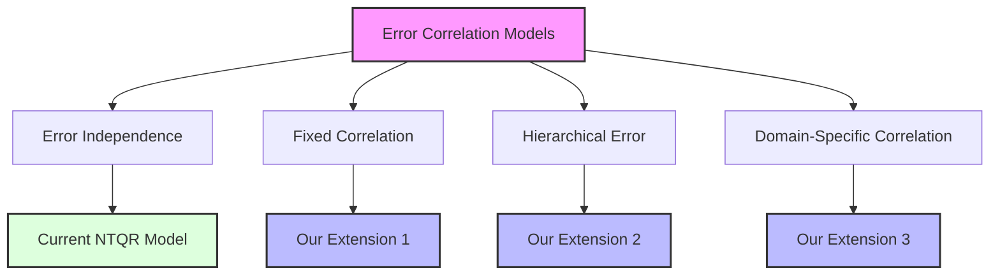
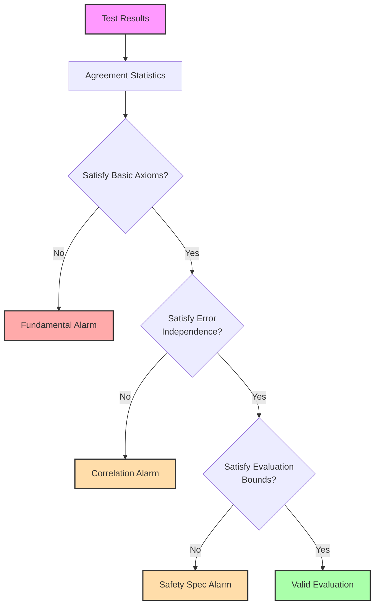
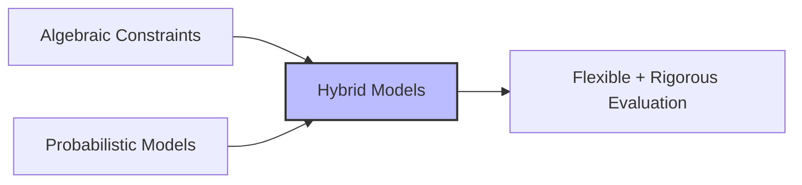
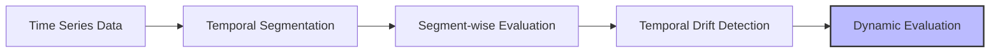
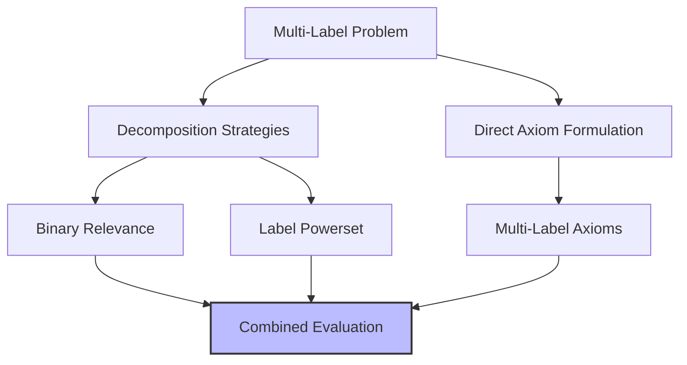
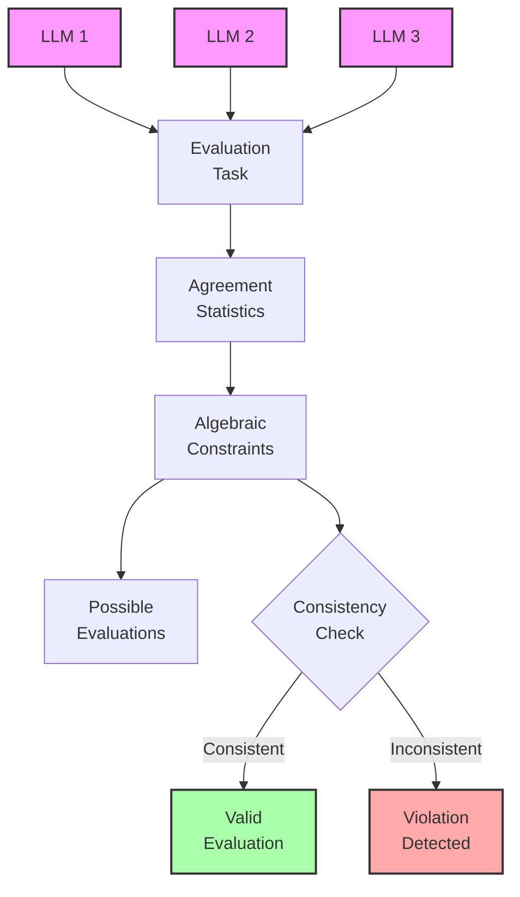

# Research Findings and Future Directions

This document outlines our research findings and future directions in extending the NTQR package.

## Current Research Findings

Our work in the fork extends the original NTQR package in several directions, with key findings summarized below.

### 1. Beyond Error Independence

While the error independence assumption produces elegant solutions for trios of classifiers, we've investigated alternative error correlation models:

**Key finding**: We've shown that for certain error correlation structures, exact solutions still exist beyond the simple error independence case.

### 2. Computational Complexity Analysis

We've analyzed the computational complexity of solving the axiom systems for various R-class problems:

| R Value | Single Classifier | Pair | Trio | Complexity Class |
|---------|-------------------|------|------|-----------------|
| R=2     | Linear            | Quadratic | Cubic | P |
| R=3     | Linear            | R²   | R³   | P |
| R=n     | Linear            | R²   | R³   | NP-Hard for large R |

**Key finding**: For R>3, we've developed approximation algorithms that provide bounds on evaluations with provable error margins.

### 3. Logical Alarms for Complex Systems

We've extended the logical alarm system to handle more complex evaluation scenarios:

**Key finding**: Our extended alarm system can detect subtle violations of assumptions that would otherwise lead to incorrect evaluations.

## Ongoing Research Directions

### 1. Hybrid Probabilistic-Algebraic Models

We're exploring ways to combine the logical rigor of algebraic evaluation with the flexibility of probabilistic models:

### 2. Time-Series Evaluation

We're extending the algebraic framework to handle time-series data, where classifier performance may drift over time:

### 3. Multi-Label Classification

We're developing axioms for multi-label classification scenarios, where each instance can belong to multiple classes simultaneously:

## Applications to LLM Evaluation

We've begun applying our extended NTQR framework to the evaluation of Large Language Models (LLMs):

### LLM as Evaluators

When LLMs evaluate other models, we can use algebraic constraints to verify consistency:

**Key finding**: We can detect when LLMs are misaligned in their evaluations without knowing ground truth.

## Future Research Questions

Our ongoing work focuses on several key questions:

1. How can we extend algebraic evaluation to handle partial or uncertain agreements?
2. Can we develop efficient algorithms for exact evaluation in high-dimensional spaces?
3. What are the theoretical limits of unsupervised evaluation under different axiom systems?
4. How can we integrate task-specific domain knowledge without sacrificing the universality of the approach?

## Research Collaborations

We are actively collaborating with researchers in the following areas:

- Algebraic geometry for more efficient computation of evaluation varieties
- Formal verification systems for AI safety
- LLM evaluation frameworks
- Theoretical computer science for complexity analysis of evaluation algorithms

These collaborations aim to further strengthen the mathematical foundations of NTQR while expanding its practical applications. 