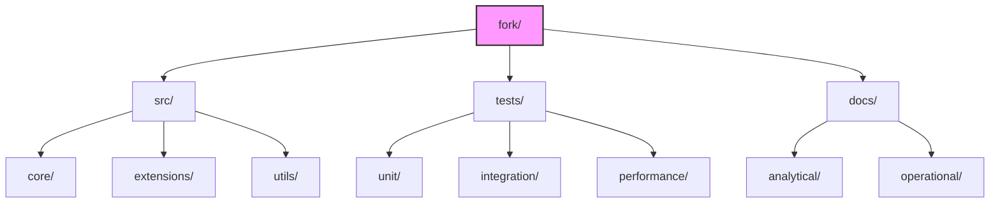

# Implementation Guide

This guide provides practical instructions for implementing and extending the NTQR framework in our fork.

## Development Environment Setup

To set up your development environment for working with our NTQR fork:

```bash
# Clone the repository if you haven't already
git clone https://github.com/yourusername/IntroductionToAlgebraicEvaluation.git
cd IntroductionToAlgebraicEvaluation

# Install the main package in development mode
pip install -e python/

# Install additional dependencies for development
pip install pytest pytest-cov black isort mypy
```

## Directory Structure and Organization

Our fork follows this organizational structure:



### Code Organization Guidelines

1. Place core extensions to NTQR functionality in `src/core/`
2. Place utility functions in `src/utils/`
3. Place experimental extensions in `src/extensions/`
4. Always write corresponding tests in the `tests/` directory

## Importing from the Main Package

When extending the main NTQR package, import from it as follows:

```python
# Importing core functionality
from python.src.ntqr import evaluations, alarms

# Importing specific modules
from python.src.ntqr.r2 import evaluators as r2_evaluators
from python.src.ntqr.r3 import evaluators as r3_evaluators

# Using specific classes
from python.src.ntqr.alarms import LabelsSafetySpecification
```

## Implementing Extensions

When implementing extensions to the NTQR framework, follow these guidelines:

### 1. New Evaluator Classes

New evaluator classes should extend the base classes from the main package:

```python
from python.src.ntqr.r2.evaluators import SupervisedEvaluation

class EnhancedEvaluation(SupervisedEvaluation):
    """
    Enhanced evaluation with additional capabilities.
    """
    
    def __init__(self, *args, **kwargs):
        super().__init__(*args, **kwargs)
        # Additional initialization
        
    def evaluate(self, *args, **kwargs):
        # Enhanced evaluation logic
        pass
```

### 2. New Axiom Implementations

When implementing new axioms, create a clear class hierarchy:

```python
from python.src.ntqr.raxioms import SingleClassifierAxiom

class EnhancedSingleClassifierAxiom(SingleClassifierAxiom):
    """
    Enhanced single classifier axiom with additional constraints.
    """
    
    def compute_constraints(self, *args, **kwargs):
        # Enhanced constraint computation
        pass
```

### 3. Visualization Extensions

For visualization extensions:

```python
from python.src.ntqr.plots import plot_evaluation_space

def enhanced_plot_evaluation_space(*args, **kwargs):
    """
    Enhanced evaluation space plotting with additional features.
    """
    # Enhanced plotting logic
    pass
```

## Testing Extensions

All extensions should be thoroughly tested:

```python
import pytest
from fork.src.core.enhanced_evaluators import EnhancedEvaluation

class TestEnhancedEvaluation:
    
    def setup_method(self):
        # Test setup
        pass
        
    def test_enhanced_evaluation_basic(self):
        # Basic functionality test
        evaluator = EnhancedEvaluation(...)
        result = evaluator.evaluate(...)
        assert result.is_valid
        
    def test_enhanced_evaluation_edge_cases(self):
        # Edge case testing
        pass
        
    def test_enhanced_evaluation_performance(self):
        # Performance testing
        pass
```

Run tests using:

```bash
# Run all tests
pytest fork/tests/

# Run specific test module
pytest fork/tests/unit/test_enhanced_evaluators.py

# Run with coverage
pytest --cov=fork fork/tests/
```

## Performance Considerations

When implementing extensions, consider performance implications:

1. For computationally intensive operations (especially for R>3), use caching:
   ```python
   from functools import lru_cache
   
   @lru_cache(maxsize=128)
   def compute_expensive_constraint(*args):
       # Expensive computation
       pass
   ```

2. For large datasets, implement streaming evaluation where possible:
   ```python
   def streaming_evaluate(data_generator):
       # Process data in chunks
       for chunk in data_generator:
           # Process chunk
           pass
   ```

3. Use NumPy for numerical operations when appropriate:
   ```python
   import numpy as np
   
   def compute_constraints(data):
       # Use vectorized operations
       return np.sum(data, axis=0) / np.sum(data)
   ```

## Documentation Standards

When documenting your extensions:

1. Use clear docstrings in NumPy format:
   ```python
   def my_function(param1, param2):
       """
       Brief description of the function.
       
       Parameters
       ----------
       param1 : type
           Description of param1
       param2 : type
           Description of param2
           
       Returns
       -------
       return_type
           Description of return value
           
       Examples
       --------
       >>> my_function(1, 2)
       3
       """
       return param1 + param2
   ```

2. Document theoretical foundations in the `docs/analytical/` directory
3. Document practical usage in the `docs/operational/` directory
4. Include examples for all new functionality

## Integration with Main Package

To ensure compatibility with the main package:

1. Regularly update your fork with changes from the main package
2. Run tests against the latest version of the main package
3. Document any behavioral differences or additional requirements

## Release Process

When preparing a release of your extensions:

1. Update version numbers in relevant files
2. Ensure all tests pass
3. Generate updated documentation
4. Create a release tag 