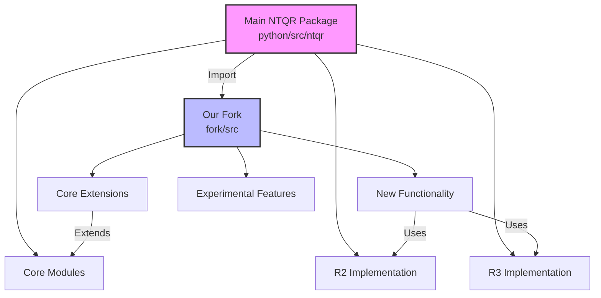
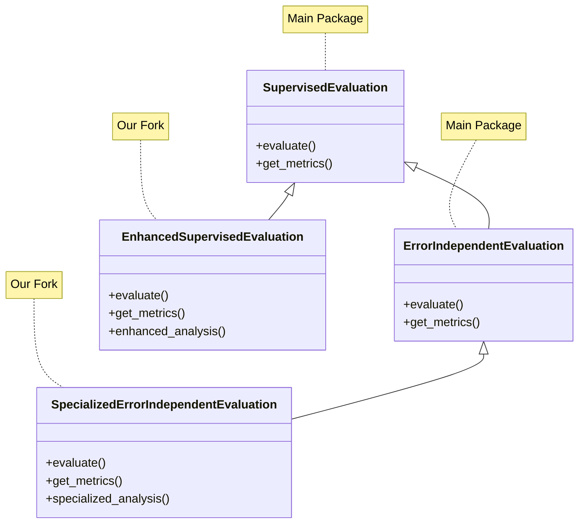

# Integration with the Main NTQR Package

This guide outlines how to effectively integrate our fork with the main NTQR package.

## Integration Architecture

Our fork is designed to complement the main NTQR package while maintaining strict isolation. Here's the overall architecture:



## Import Structure

When working with both the main package and our fork, follow these import patterns:

```python
# Importing from main package
from python.src.ntqr import evaluations, alarms
from python.src.ntqr.r2 import evaluators as r2_evaluators

# Importing from our fork
from fork.src.core import enhanced_evaluators
from fork.src.extensions import specialized_alarms
```

## Class Inheritance Structure

Our extensions generally inherit from the main package's classes:



## Maintaining Compatibility

To ensure ongoing compatibility with the main package:

1. **Version Tracking**: Track the version of the main package you're developing against
   ```python
   # fork/src/__init__.py
   __main_package_version__ = "0.5.1"  # Version of NTQR this fork is compatible with
   ```

2. **Compatibility Testing**: Regularly run tests against the main package
   ```bash
   # Run compatibility tests
   pytest fork/tests/integration/main_package/
   ```

3. **Feature Detection**: Check for features before using them
   ```python
   # Check if a feature exists in the main package
   try:
       from python.src.ntqr import new_feature
       HAS_NEW_FEATURE = True
   except ImportError:
       HAS_NEW_FEATURE = False
       
   if HAS_NEW_FEATURE:
       # Use new feature
   else:
       # Use alternative implementation
   ```

## Using Main Package Components

When using components from the main package:

### Evaluators

```python
from python.src.ntqr.r2.evaluators import ErrorIndependentEvaluation
from fork.src.utils.compatibility import ensure_compatible

# Ensure compatibility with our version
main_evaluator = ensure_compatible(ErrorIndependentEvaluation)()

# Use as normal
result = main_evaluator.evaluate(data)
```

### Axioms

```python
from python.src.ntqr.raxioms import SingleClassifierAxiom
from fork.src.core.enhanced_axioms import EnhancedSingleClassifierAxiom

# Base axiom from main package
base_axiom = SingleClassifierAxiom()

# Our enhanced axiom
enhanced_axiom = EnhancedSingleClassifierAxiom()

# Use both in compatible ways
base_result = base_axiom.compute_constraints(data)
enhanced_result = enhanced_axiom.compute_constraints(data)
```

### Data Structures

```python
from python.src.ntqr.r2.datasketches import TrioLabelVoteCounts
from fork.src.utils.converters import convert_to_enhanced_format

# Use main package data structure
trio_counts = TrioLabelVoteCounts(...)

# Convert to our enhanced format if needed
enhanced_counts = convert_to_enhanced_format(trio_counts)
```

## Handling API Changes

When the main package API changes:

1. **Adapter Pattern**: Use adapters to maintain compatibility
   ```python
   class MainPackageAdapter:
       """Adapter for main package API changes."""
       
       def __init__(self, main_component):
           self.main_component = main_component
           
       def new_method_name(self, *args, **kwargs):
           """Adapt to renamed method."""
           return self.main_component.old_method_name(*args, **kwargs)
   ```

2. **Feature Flags**: Use feature flags to handle behavior changes
   ```python
   # Configuration
   USE_NEW_BEHAVIOR = True  # Set based on main package version
   
   # Code
   if USE_NEW_BEHAVIOR:
       # Use new behavior
   else:
       # Use old behavior
   ```

## Code Organization for Integration

Organize your code to facilitate clean integration:

```
fork/src/
├── core/                   # Core extensions to main package
├── extensions/             # New functionality built on main package
├── utils/
│   ├── compatibility.py    # Compatibility utilities
│   └── converters.py       # Data conversion utilities
└── __init__.py             # Version tracking and feature detection
```

## Extended Example: Integration with Error Independent Evaluation

Here's a comprehensive example of integrating with the error independent evaluation from the main package:

```python
from python.src.ntqr.r2.evaluators import ErrorIndependentEvaluation
from fork.src.extensions.correlation_models import CorrelatedErrorModel

class EnhancedErrorIndependentEvaluation(ErrorIndependentEvaluation):
    """
    Enhanced error independent evaluation that supports correlated errors.
    """
    
    def __init__(self, correlation_model=None, *args, **kwargs):
        super().__init__(*args, **kwargs)
        self.correlation_model = correlation_model or CorrelatedErrorModel()
        
    def evaluate(self, data, *args, **kwargs):
        """
        Enhanced evaluation with correlation handling.
        
        Extends the main package's evaluate method with correlation support.
        Falls back to standard behavior when correlation is not detected.
        """
        # Check if correlation is detected
        if self.correlation_model.detect_correlation(data):
            # Handle correlated case with our enhanced logic
            return self._evaluate_with_correlation(data, *args, **kwargs)
        else:
            # Use the main package's implementation for standard cases
            return super().evaluate(data, *args, **kwargs)
            
    def _evaluate_with_correlation(self, data, *args, **kwargs):
        """
        Internal method to handle evaluation with correlated errors.
        """
        # Implementation of correlation-aware evaluation
        pass
```

## Documentation Practices

When documenting integration:

1. **Clearly mark extensions**: Indicate which components extend the main package
   ```python
   class EnhancedEvaluation(SupervisedEvaluation):
       """
       Enhanced evaluation (extends SupervisedEvaluation from main package).
       
       This class extends the main package's SupervisedEvaluation with
       additional capabilities for [description].
       """
   ```

2. **Document compatibility**: Specify which versions of the main package are supported
   ```
   ## Compatibility
   
   This module is compatible with NTQR v0.5.0 and above.
   ```

3. **Highlight differences**: Clearly document behavioral differences
   ```
   ## Differences from Main Package
   
   This implementation differs from the main package in the following ways:
   
   1. Supports correlated error models
   2. Handles multi-label data
   3. Provides enhanced visualization
   ```

## Handling Main Package Updates

When the main package is updated:

1. Update the compatibility version tracking
2. Run all integration tests
3. Update adapters and compatibility utilities as needed
4. Document any changes in integration behavior 