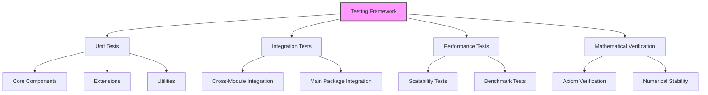
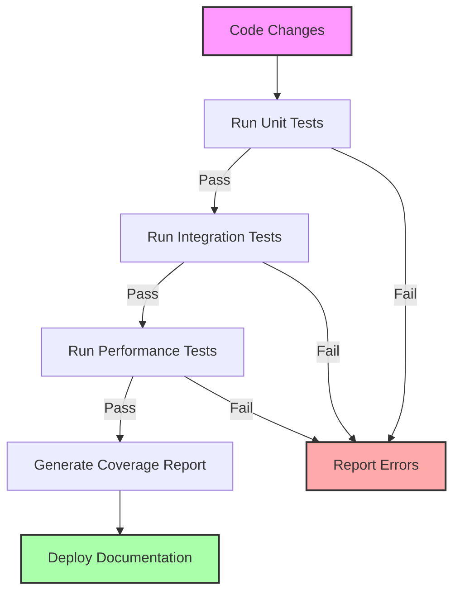

# Testing Framework Guide

This guide outlines the testing framework and methodologies for our fork of the NTQR package.

## Testing Philosophy

Our testing approach is based on three key principles:

1. **Comprehensive Coverage**: All code should be thoroughly tested
2. **Mathematical Verification**: Tests should verify algebraic properties
3. **Performance Validation**: Tests should validate performance characteristics



## Test Directory Structure

The testing framework uses the following directory structure:

```
fork/tests/
├── unit/                  # Unit tests for specific components
│   ├── core/              # Tests for core components
│   ├── extensions/        # Tests for extensions
│   └── utils/             # Tests for utilities
├── integration/           # Tests for component interactions
│   ├── internal/          # Tests for interactions within our fork
│   └── main_package/      # Tests for interactions with the main package
├── performance/           # Performance and scalability tests
│   ├── benchmarks/        # Benchmark tests
│   └── scalability/       # Scalability tests
└── conftest.py            # Common test fixtures and utilities
```

## Writing Tests

### Unit Tests

Unit tests validate individual components in isolation:

```python
# fork/tests/unit/core/test_enhanced_evaluator.py
import pytest
import numpy as np
from fork.src.core.enhanced_evaluators import EnhancedEvaluation

class TestEnhancedEvaluation:
    
    def setup_method(self):
        # Setup test data
        self.test_data = np.array([
            [10, 2],  # TP, FN
            [3, 15]   # FP, TN
        ])
        self.evaluator = EnhancedEvaluation()
        
    def test_basic_evaluation(self):
        """Test basic evaluation functionality."""
        result = self.evaluator.evaluate(self.test_data)
        # Assert expected properties of result
        assert 0 <= result.accuracy_p1 <= 1
        assert 0 <= result.accuracy_p0 <= 1
        
    def test_evaluation_equation(self):
        """Test that evaluation satisfies axiom equations."""
        result = self.evaluator.evaluate(self.test_data)
        # Verify the single classifier axiom is satisfied
        total_accuracy = (result.accuracy_p1 * self.test_data[0].sum() + 
                          result.accuracy_p0 * self.test_data[1].sum()) / np.sum(self.test_data)
        expected = (self.test_data[0, 0] + self.test_data[1, 1]) / np.sum(self.test_data)
        assert abs(total_accuracy - expected) < 1e-10
        
    def test_error_handling(self):
        """Test error handling for invalid inputs."""
        with pytest.raises(ValueError):
            self.evaluator.evaluate(np.array([[-1, 2], [3, 4]]))  # Negative values
```

### Integration Tests

Integration tests verify interactions between components:

```python
# fork/tests/integration/internal/test_evaluator_axiom_integration.py
import pytest
from fork.src.core.enhanced_evaluators import EnhancedEvaluation
from fork.src.core.enhanced_axioms import EnhancedSingleClassifierAxiom

class TestEvaluatorAxiomIntegration:
    
    def setup_method(self):
        # Setup test components
        self.axiom = EnhancedSingleClassifierAxiom()
        self.evaluator = EnhancedEvaluation(axiom=self.axiom)
        self.test_data = ...  # Test data setup
        
    def test_axiom_integration(self):
        """Test that evaluator correctly uses the axiom."""
        result = self.evaluator.evaluate(self.test_data)
        # Verify the result is consistent with the axiom's constraints
        assert self.axiom.verify(result, self.test_data)
```

### Main Package Integration Tests

Tests for integration with the main NTQR package:

```python
# fork/tests/integration/main_package/test_main_package_integration.py
import pytest
from python.src.ntqr.r2.evaluators import ErrorIndependentEvaluation
from fork.src.extensions.enhanced_error_independent import EnhancedErrorIndependentEvaluation

class TestMainPackageIntegration:
    
    def setup_method(self):
        # Setup test data
        self.test_data = ...  # Test data setup
        self.main_evaluator = ErrorIndependentEvaluation()
        self.fork_evaluator = EnhancedErrorIndependentEvaluation()
        
    def test_consistent_with_main_package(self):
        """Test that our extension is consistent with the main package in standard cases."""
        main_result = self.main_evaluator.evaluate(self.test_data)
        fork_result = self.fork_evaluator.evaluate(self.test_data)
        
        # Verify that results match in standard cases
        assert abs(main_result.accuracy_p1 - fork_result.accuracy_p1) < 1e-10
        assert abs(main_result.accuracy_p0 - fork_result.accuracy_p0) < 1e-10
        
    def test_extensions_beyond_main_package(self):
        """Test the additional capabilities beyond the main package."""
        # Test data that requires the enhanced capabilities
        complex_test_data = ...
        
        # Main package should fail or give suboptimal results
        with pytest.raises(Exception):
            self.main_evaluator.evaluate(complex_test_data)
            
        # Our extension should handle it
        fork_result = self.fork_evaluator.evaluate(complex_test_data)
        assert fork_result is not None
```

### Performance Tests

Performance tests verify scalability and efficiency:

```python
# fork/tests/performance/benchmarks/test_evaluator_benchmark.py
import pytest
import time
import numpy as np
from fork.src.core.enhanced_evaluators import EnhancedEvaluation

class TestEvaluatorBenchmark:
    
    @pytest.mark.parametrize("data_size", [100, 1000, 10000, 100000])
    def test_evaluation_scaling(self, data_size):
        """Test how evaluation performance scales with data size."""
        # Generate test data of specified size
        test_data = self._generate_test_data(data_size)
        
        evaluator = EnhancedEvaluation()
        
        # Measure execution time
        start_time = time.time()
        result = evaluator.evaluate(test_data)
        end_time = time.time()
        
        execution_time = end_time - start_time
        
        # Log the results for analysis
        print(f"Data size: {data_size}, Execution time: {execution_time:.6f} seconds")
        
        # Assert reasonable performance scaling
        # Linear or near-linear scaling is ideal
        if data_size > 100:
            assert execution_time < (data_size / 100) * 2  # Should scale at most linearly
            
    def _generate_test_data(self, size):
        """Generate test data of specified size."""
        # Implementation of test data generation
        pass
```

## Mathematical Verification Tests

These tests verify that mathematical properties and axioms hold:

```python
# fork/tests/unit/core/test_axiom_properties.py
import pytest
import numpy as np
import sympy as sp
from fork.src.core.enhanced_axioms import EnhancedSingleClassifierAxiom

class TestAxiomProperties:
    
    def test_axiom_algebraic_properties(self):
        """Test algebraic properties of the axiom."""
        axiom = EnhancedSingleClassifierAxiom()
        
        # Define symbolic variables for verification
        p1, p0 = sp.symbols('p1 p0')
        n11, n10, n01, n00 = sp.symbols('n11 n10 n01 n00')
        
        # Get the symbolic equation from the axiom
        equation = axiom.get_symbolic_equation(p1, p0, n11, n10, n01, n00)
        
        # Verify algebraic properties
        # For example, verify that when p1=p0=1, the equation implies perfect classification
        substitution = {p1: 1, p0: 1, n11: 'n1', n00: 'n0', n10: 0, n01: 0}
        result = equation.subs(substitution)
        # Verify the result is a tautology
        assert result == 0
```

## Running Tests

To run the tests, use the following commands:

```bash
# Run all tests
pytest fork/tests/

# Run specific test categories
pytest fork/tests/unit/
pytest fork/tests/integration/
pytest fork/tests/performance/

# Run tests with coverage report
pytest --cov=fork fork/tests/

# Run tests and output detailed report
pytest -v fork/tests/

# Run tests matching a specific pattern
pytest -k "axiom" fork/tests/
```

## Continuous Integration

Our testing framework integrates with CI/CD pipelines:



## Test Data Management

For reproducible tests, we use:

1. **Fixed seed random data**: Generate random data with fixed seeds
2. **Real-world datasets**: Use standardized benchmark datasets
3. **Synthetic edge cases**: Create synthetic data for edge cases

## Writing Good Tests

Follow these guidelines for effective tests:

1. **Independent**: Tests should not depend on each other
2. **Focused**: Each test should test one specific thing
3. **Readable**: Tests should be easy to understand
4. **Fast**: Unit tests should execute quickly
5. **Deterministic**: Tests should produce the same result every time
6. **Complete**: Test both normal cases and edge cases

## Mathematical Verification in Tests

For algebraic evaluation, focus on testing:

1. **Axiom satisfaction**: Verify results satisfy axioms
2. **Geometric constraints**: Verify results lie within valid regions
3. **Numerical stability**: Test behavior with extreme values
4. **Logical consistency**: Verify logical consistency of results

## Troubleshooting Tests

Common issues and solutions:

1. **Floating-point precision**: Use appropriate tolerances in assertions
2. **Random failures**: Fix seed values for reproducibility
3. **Performance variability**: Use multiple runs for performance tests
4. **Integration failures**: Check version compatibility with main package 